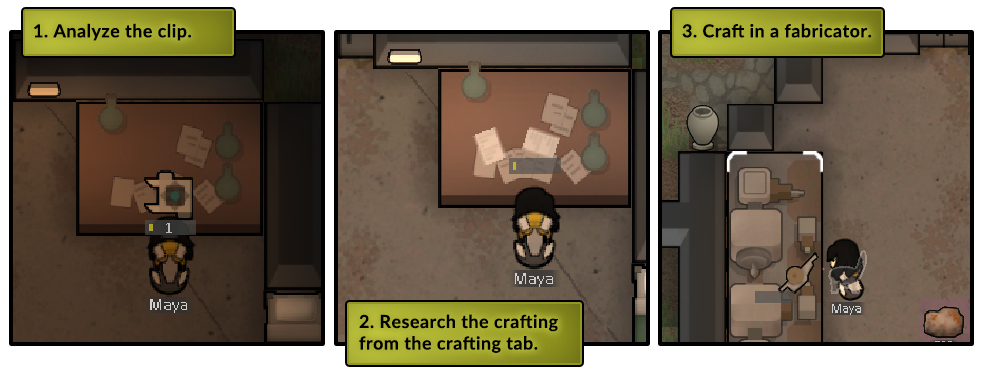

# CraftMechtechChips
RimWorld mod for Biotech to craft high mechtech chips.

## 

Craft Signal chips, Powerfocus chips and Nano structuring chips.

Unlock the power to craft mechtech chips through research once you've analyzed the chips. Instead of repeatedly battling the same bosses to obtain mechtech chips, this mod offers you the alternative to craft them yourself.

Additionally, this mod introduces a research project for Mechlink crafting.

This mod is safe to add or remove from your saves at any time (though it's best not to remove it during the crafting process).

This mod is tailored for end-game progression, offering experienced players an alternative pathway to enhance their technological capabilities. It aims to offer a supplementary method for advancing within the game.

### 

1. Analyze the chip.
2. Unlock the crafting ability through research in the crafting tab.
3. Fabricate the mechtech chip using a fabricator.

### 

Additionally, this mod introduces a research project for Mechlink crafting.

The ability to craft
	- Signal chip
	- Powerfocus chip
	- Nano chip
	- Mechlink

### 

#### AlphaMechs support

Now compatible with the AlphaMechs mod, allowing you to craft Hyper-linkage chips, Stellar processing chips, and Quantum matrix chips! (Ensure this mod is loaded after AlphaMechs for proper functionality.)

## In-game values
### Research time
Requires Multi analyzer.
- Signal chip: 3000
- Powerfocus chip: 4000
- Nanostructuring chip: 5000
### Crafting costs
Requires Fabrication bench.
#### Signal chip
- Basic subcore (1)
- Advanced component (6)
- Plasteel (50)
#### Powerfocus chip
- Signal chip (2)
- Standard subcore (1)
- Advanced component (6)
- Plasteel (75)
#### Nano structuring chip
- Powerfocus chip (2)
- High subcore (1)
- Plasteel (120)
- Advanced component (8)
### Skills needed to craft
- Signal chip: 9 crafting (can be crafted by fabricators)
- Powerfocus chip: 10 crafting (can be crafted by fabricators)
- Nano structuring chip: 10 crafting, 16 intellectual (must be crafted by a colonist)
### Amount of work (time)
- Signal chip: 8000
- Powerfocus chip: 10000
- Nano structuring chip: 12000
## In-game values for AlphaMechs
### Research time
Requires Multi analyzer.
- Hyper-linkage chip: 6000
- Stellar processing chip: 6000
- Quantum matrix chip: 6000
### Crafting costs
Requires Fabrication bench.
#### Hyper-linkage chip
- Nano structuring Chip (2)
- High subcore (1)
- Advanced component (8)
- Uranium (10)
#### Stellar processing chip
- Hyper-linkage chip (2)
- High subcore (2)
- Advanced component (12)
- Uranium (10)
#### Quantum matrix chip
- Stellar processing chip (2)
- High subcore (4)
- Advanced component (12)
- Uranium (10)
### Skills needed to craft (must be crafted by a colonist)
- Hyper-linkage chip: 10 crafting, 18 intellectual
- Stellar processing chip: 12 crafting, 18 intellectual
- Quantum matrix chip: 12 crafting, 20 intellectual
### Amount of work (time)
- Hyper-linkage chip: 14000
- Stellar processing chip: 16000
- Quantum matrix chip: 18000
## Patch notes
### CMC build 1.5
- Added description and title to the research tab
- Added steam page images
- Updated git readme
### CMC build 1.4
- Updated to support Rimworld version 1.5
- Fixed ResearchProjects defs renamed from "studied" to "analyzed"
- Removed MultiAnalyzer from requirements on signal chip crafting research
- Updated preview image
### CMC build 1.3
- Changed some costs for crafting the chips, so it needs less raw resources and are utilizing advanced components instead. The total costs are slightly cheaper for the first two chips, slightly more expensive for the third one - but the raw amount of plasteel needed are the same or less. 
- New raw plasteel costs:
  - Signal chip: 125 -> 110
  - Powerfocus chip: 150 -> 135
  - Nano structuring chip: no change
- New raw gold costs:
  - Signal chip: 0 -> 18
  - Powerfocus chip: 0 -> 18
  - Nano structuring chip: 0 -> 24
- Nano structuring chip crafting research time lowered slightly: 6000 -> 5000
- Signal chip crafting research time increased slightly: 2000 -> 3000
- Added a 'Mechtech crafting' tab in the research menu
- Initial support for the mod AlphaMechs (https://github.com/juanosarg/AlphaMechs/tree/main) I may need to tweak some numbers though.
- Added Mechlink crafting. It's not cheap though, it's pretty expensive as it's supposed to be an end-game thing.
### CMC build 1.2
- I find that by end-game my subcore crafting bench and scanners just sit there which is quite boring. So I removed steel and gold cost from crafting the chips and replaced it with subcores to utilize them more. So the chips need one subcore from the respective tier. The actual cost for the chips are about the same, but it requires less different stuff but more streamlined ingredients.
  - Signal chip: Basic subcore
  - Powerfocus chip: Standard subcore
  - Nano structuring chip: High subcore
- Increased workAmount even more
  - Signal chip: 5200 -> 8000
  - Powerfocus chip: 6000 -> 10000
  - Nano structuring chip: 6800 -> 12000
- Reduced plasteel costs considering the cost for subcores
  - Powerfocus chip: 200 -> 150
  - Nano structuring chip: 250 -> 200

Crafting a Nano structuring chip from scratch is now an even 1000 plasteel. But requires some additional work and resources with the addition of subcores.
### CMC build 1.1
  - Decreased overall cost of plasteel by 200 when crafting a Nano structuring chip from scratch
    - Signal chip plasteel cost 150 -> 125
    - Powerfocus chip plasteel cost 225 -> 200
    - Nano structuring chip plasteel cost 300 -> 250
  - Removed Intellectual requirement of crafting Signal chips and Powerfocus chips, so now your fabricators are able to craft them
  - Increased workAmount by a small amount for each chip
